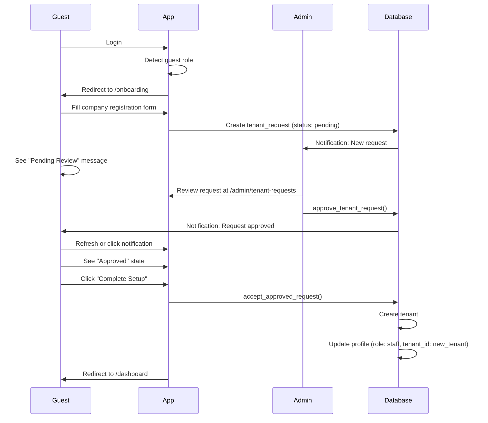

# CTS ERP - User Flows Documentation

This document describes all user flows in the CTS ERP application.

## Table of Contents

1. [Role System](#role-system)
2. [User Registration Flow](#user-registration-flow)
3. [Tenant Onboarding Flow](#tenant-onboarding-flow)
4. [Admin Approval Flow](#admin-approval-flow)
5. [Notification System](#notification-system)
6. [Authentication Flow](#authentication-flow)

---

## Role System

The application has four user roles with different permissions:

### Roles

| Role | Description | Permissions |
|------|-------------|-------------|
| **Admin** | System administrator | Full access, approve/reject tenant requests, manage all data |
| **Guest** | New user without company | Can only access onboarding page, submit tenant request |
| **Staff** | Employee of a company | Full access to tenant's data (orders, invoices, customers, etc.) |
| **Customer** | External customer | Limited access (view their orders, invoices) - *Future feature* |

### Role Transitions

```
New User Signs Up
       │
       ▼
    [Guest] ──────────────────────────────┐
       │                                   │
       │ Submit Tenant Request             │ (Can't access main app)
       ▼                                   │
  Admin Approves                           │
       │                                   │
       ▼                                   │
  Guest Accepts                            │
       │                                   │
       ▼                                   │
    [Staff] ◄─────────────────────────────┘
       │
       │ (Admin promotes)
       ▼
    [Admin]
```

---

## User Registration Flow

### 1. Sign Up

1. User navigates to `/register`
2. Enters email, password, and full name
3. Submits registration form
4. Supabase Auth creates the user
5. Trigger `handle_new_user()` creates profile with:
   - `role = 'guest'`
   - `tenant_id = NULL`
6. User receives confirmation email (if email confirmation enabled)
7. User is redirected to login page

### 2. First Login

1. User logs in at `/login`
2. System detects user is a `guest` without `tenant_id`
3. User is automatically redirected to `/onboarding`

---

## Tenant Onboarding Flow

### Overview



### Step-by-Step

#### Guest Submits Registration

1. Guest sees the onboarding page at `/onboarding`
2. Fills out company registration form:
   - Company Name (required)
   - Business Email
   - Phone Number
   - Business Address
   - Business Type
   - Description
3. Submits the form
4. System creates `tenant_request` record with `status = 'pending'`
5. System creates notification for admins
6. Guest sees "Pending Review" state

#### Admin Reviews Request

1. Admin navigates to `/admin/tenant-requests`
2. Sees list of pending requests
3. Reviews company information
4. Either:
   - **Approves**: Clicks "Approve" (optionally adds notes)
   - **Rejects**: Clicks "Reject" (optionally adds reason)
5. System updates `tenant_request.status`
6. System creates notification for the guest

#### Guest Completes Setup

1. Guest receives notification (in-app or email)
2. If approved:
   - Guest sees "Congratulations" message
   - Clicks "Complete Setup & Enter Dashboard"
   - System calls `accept_approved_request()` which:
     - Creates new tenant with company name
     - Updates user's profile: `role = 'staff'`, `tenant_id = new_tenant`
     - Updates request status to `accepted`
   - User is redirected to `/dashboard`
3. If rejected:
   - Guest sees rejection message with reason
   - Can submit a new request

---

## Admin Approval Flow

### Viewing Requests

**Location**: `/admin/tenant-requests`

**Features**:
- Filter by status: All, Pending, Approved, Rejected, Accepted
- Search by company name, email, or user name
- View request details
- Approve or reject pending requests

### Approval Process

1. Admin clicks "Approve" on a pending request
2. Optionally adds notes for the user
3. System calls `approve_tenant_request()` function
4. Function:
   - Updates request `status = 'approved'`
   - Sets `reviewed_by` and `reviewed_at`
   - Creates notification for the user
5. User can now complete setup

### Rejection Process

1. Admin clicks "Reject" on a pending request
2. Should add reason in notes field
3. System calls `reject_tenant_request()` function
4. Function:
   - Updates request `status = 'rejected'`
   - Sets `reviewed_by` and `reviewed_at`
   - Creates notification with rejection reason
5. User sees rejection message

---

## Notification System

### Notification Types

| Type | Trigger | Message |
|------|---------|---------|
| `tenant_request_submitted` | Guest submits request | (For admins) New request received |
| `tenant_request_approved` | Admin approves | Your registration has been approved! |
| `tenant_request_rejected` | Admin rejects | Your registration was not approved |
| `tenant_created` | Guest accepts approval | Welcome to your new company! |
| `role_updated` | Role changes | Your role has been updated |
| `system` | System events | Various system messages |

### Features

- **In-app notifications**: Bell icon in topbar shows unread count
- **Real-time updates**: Using Supabase Realtime subscriptions
- **Mark as read**: Click notification or "Mark all read"
- **Notification history**: View recent notifications

### Database Schema

```sql
CREATE TABLE notifications (
  id uuid PRIMARY KEY,
  user_id uuid NOT NULL REFERENCES auth.users(id),
  type notification_type NOT NULL,
  title text NOT NULL,
  message text NOT NULL,
  data jsonb DEFAULT '{}',
  is_read boolean DEFAULT false,
  read_at timestamptz,
  created_at timestamptz DEFAULT now()
);
```

---

## Authentication Flow

### Login

1. User enters email and password at `/login`
2. Supabase Auth validates credentials
3. Session is created
4. User profile is fetched (includes role and tenant)
5. Routing based on role:
   - **Guest without tenant**: Redirect to `/onboarding`
   - **Staff/Admin with tenant**: Redirect to `/dashboard`

### Logout

1. User clicks "Sign out" in user menu
2. Session is destroyed
3. User is redirected to `/login`

### Session Persistence

- Sessions are stored in browser
- `onAuthStateChange` listener handles session changes
- Profile is fetched whenever session changes

---

## Route Protection

### Route Types

| Route | Protection | Description |
|-------|------------|-------------|
| `/login`, `/register` | Public | Anyone can access |
| `/onboarding` | Guest Only | Only guests without tenant |
| `/dashboard`, `/orders`, etc. | Protected + Tenant | Requires auth + tenant |
| `/admin/*` | Admin Only | Requires admin role |

### Protection Logic

```typescript
// ProtectedRoute (requireTenant = true)
1. If loading → Show spinner
2. If not authenticated → Redirect to /login
3. If guest without tenant → Redirect to /onboarding
4. If requireAdmin and not admin → Redirect to /dashboard
5. Otherwise → Show content

// GuestOnlyRoute
1. If loading → Show spinner
2. If not authenticated → Redirect to /login
3. If not guest or has tenant → Redirect to /dashboard
4. Otherwise → Show onboarding
```

---

## Database Functions

### `approve_tenant_request(p_request_id, p_notes)`

**Security**: SECURITY DEFINER, requires admin role

**Actions**:
1. Validates caller is admin
2. Finds pending request
3. Updates status to 'approved'
4. Creates notification for user

### `reject_tenant_request(p_request_id, p_notes)`

**Security**: SECURITY DEFINER, requires admin role

**Actions**:
1. Validates caller is admin
2. Finds pending request
3. Updates status to 'rejected'
4. Creates notification with reason

### `accept_approved_request(p_request_id)`

**Security**: SECURITY DEFINER

**Actions**:
1. Validates request belongs to caller
2. Validates status is 'approved'
3. Creates tenant with company name
4. Updates user profile (role → staff, tenant_id → new)
5. Updates request status to 'accepted'
6. Creates welcome notification

---

## Future Enhancements

### Planned

- [ ] Email notifications (via Supabase Edge Functions)
- [ ] Customer role implementation
- [ ] Multi-user tenant invitations
- [ ] Admin user management
- [ ] Audit logging for all actions

### Considerations

- Email templates for notifications
- Rate limiting for tenant requests
- Request expiration (approved requests expire after X days)
- Multiple tenants per user

