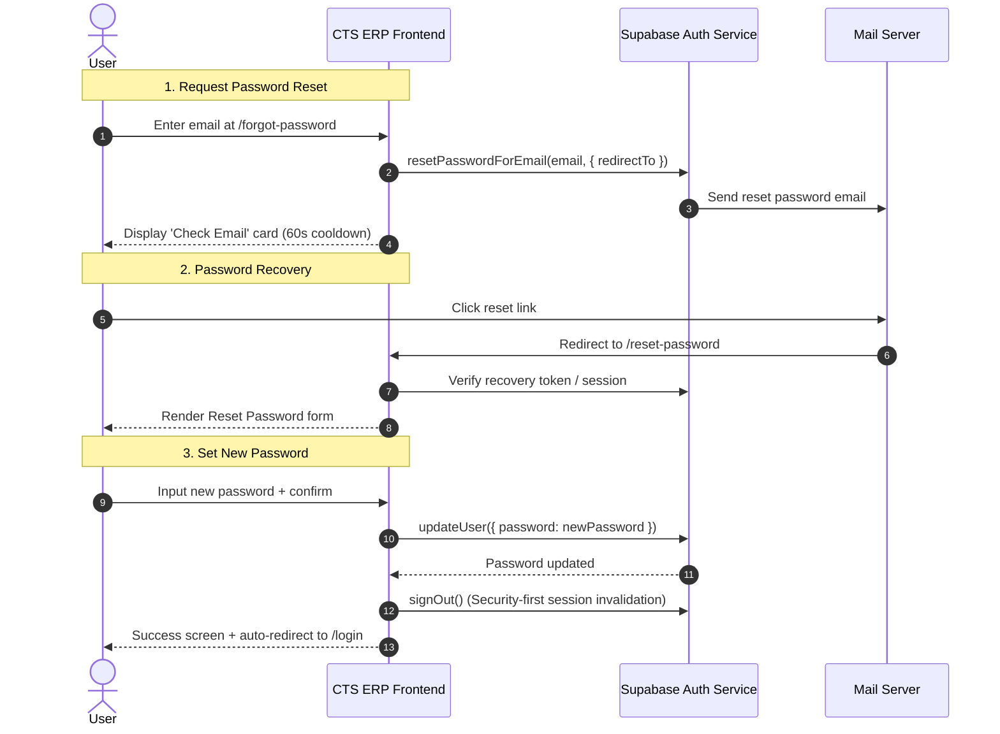

# Authentication & Password Recovery Flow

This guide details the authentication architecture, the password recovery flow via Supabase Auth, and the unified password visibility system implemented in CTS ERP.

---

## 1. Architecture Overview

CTS ERP leverages **Supabase Auth** for identity management, session tokens, and security policies.



---

## 2. Supabase Dashboard Configuration

To ensure seamless email recovery delivery in development and production, ensure the following settings in your Supabase project dashboard:

### A. Redirect URLs (Authentication -> URL Configuration)
Add the following URL patterns to **Redirect URLs**:
- `http://localhost:5173/reset-password` (or your local Vite dev port)
- `http://localhost:3000/reset-password`
- `https://your-domain.com/reset-password` (Production domain)

### B. Email Templates (Authentication -> Email Templates -> Reset Password)
The default template includes the `{{ .ConfirmationURL }}` variable, which automatically embeds your application redirect URL:
```html
<h2>Reset Password</h2>
<p>Follow this link to reset the password for your user:</p>
<p><a href="{{ .ConfirmationURL }}">Reset Password</a></p>
```

---

## 3. Implemented Components & Hooks

### A. `PasswordInput` (`frontend/src/components/ui/password-input.tsx`)
A drop-in replacement for standard `<Input type="password" />`:
- Integrates `Eye` and `EyeOff` icons from `lucide-react`.
- Toggles input type between `"password"` and `"text"`.
- `tabIndex={-1}` on toggle button prevents interruption of keyboard navigation.
- Localized `aria-label` and `title` attributes for full screen-reader accessibility.
- Used across:
  - `Login.tsx` (password field)
  - `Register.tsx` (password & confirm password fields)
  - `ResetPassword.tsx` (new password & confirm password fields)

#### Usage Example:
```tsx
import { PasswordInput } from '@/components/ui/password-input'

<PasswordInput
  id="password"
  placeholder="••••••••"
  value={password}
  onChange={(e) => setPassword(e.target.value)}
  required
  className="h-11"
/>
```

### B. `useAuth` Hook & `AuthContext` (`frontend/src/contexts/AuthContext.tsx`, `frontend/src/hooks/useAuth.ts`)
The application uses a centralized React `AuthProvider` to maintain a single source of truth across all components:
- `user`, `session`, `profile`, `role`, `tenantId`, `tenantName`, `isTenantLocked`, `tenantLockedReason`.
- `resetPassword(email: string)`: Sends a recovery link pointing to `${window.location.origin}/reset-password`.
- `updatePassword(password: string)`: Updates the authenticated user's password via `supabase.auth.updateUser`.
- `signOut()`: Destroys the Supabase session, resets client state, and performs a clean redirection to `/login` via `window.location.href = '/login'`.

---

## 4. Route Specifications

| Route | Component | Access | Purpose |
|---|---|---|---|
| `/forgot-password` | `ForgotPassword.tsx` | Public | Submit email to trigger password reset link; displays cooldown countdown |
| `/reset-password` | `ResetPassword.tsx` | Public / Recovery | Verifies recovery token from URL, allows entering new password, validates rules, auto-redirects |
| `/login` | `Login.tsx` | Public | Standard login with direct link to `/forgot-password` |
| `/register` | `Register.tsx` | Public | Account creation with dual `PasswordInput` fields |
| `/dashboard` & business modules | Protected | Active Tenant members | Main ERP modules; blocked if tenant `is_locked` |

---

## 5. Security & Tenant Access Enforcement

1. **Security-First Post-Reset Logout**: Once `updateUser` succeeds on `/reset-password`, `signOut()` is called immediately to clear the temporary recovery session, ensuring the user explicitly authenticates with their new credentials.
2. **Invalid & Expired Link Protection**: Visiting `/reset-password` without a valid recovery token immediately displays a friendly "Link Expired or Invalid" prompt instead of hanging or failing cryptically.
3. **Resend Cooldown**: `/forgot-password` enforces a 60-second client-side cooldown timer to mitigate email flooding/spamming.
4. **Data Masking**: All password input fields default to masked characters with explicit opt-in eye toggle.
5. **Tenant Lock & Suspension Enforcement**:
   - Admins can lock any completed tenant from the Admin panel with an optional reason.
   - If a locked tenant's user attempts to access protected routes, `ProtectedRoute` renders `TenantLockedScreen`.
   - Access to business operations (orders, invoices, inventory) is completely halted until an Admin unlocks the tenant.
   - System administrators (`role = 'admin'`) retain full platform access regardless of tenant lock state.
6. **Session Timeout & Administrative Invalidation**:
   - Super Administrators configure global session expiration duration (minutes) in `system_settings`.
   - On login, client establishes `cts_session_start_time` in `sessionStorage`.
   - `AuthContext` runs client-side background validation checks every 30 seconds and upon browser tab visibility focus.
   - If session duration exceeds `timeout_minutes`, user is automatically signed out with `/login?reason=session_expired`.
   - If an Administrator resets an individual user or all sessions via `/admin/security`, `profiles.session_valid_after` is bumped to `now()`. When client detects `session_valid_after > cts_session_start_time`, it immediately executes `signOut('session_reset')`, terminating active sessions and displaying a security reset notice.
   - Global session reset automatically exempts the calling Super Administrator to prevent accidental lockout.


